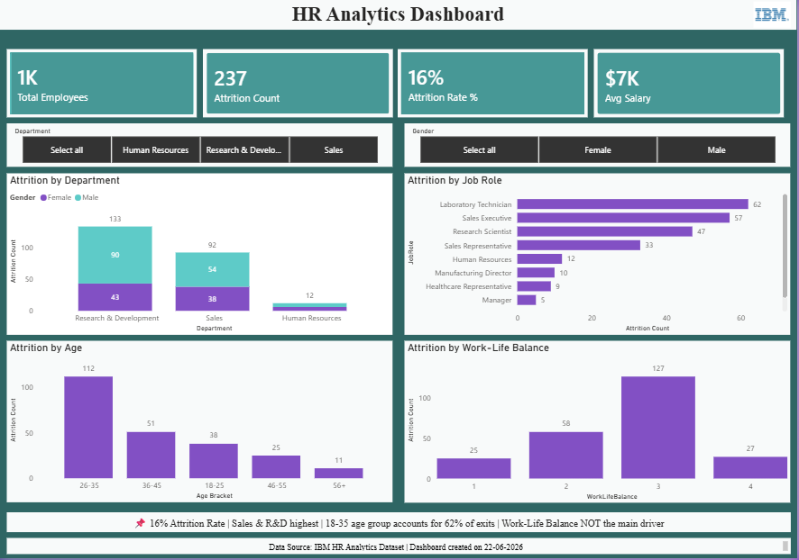

# 📊 HR Analytics Dashboard - Power BI

---

## 📋 Project Overview

This project is an interactive **HR Analytics Dashboard** built using **Microsoft Power BI**. The dashboard analyzes employee attrition patterns using the **IBM HR Analytics Dataset** from Kaggle, providing actionable insights to reduce employee turnover.

**The dashboard answers key business questions:**
- What is the overall attrition rate?
- Which departments and roles have the highest turnover?
- Which age groups are most likely to leave?
- Does work-life balance impact attrition?
- How does attrition vary by gender?

---

## 🎯 Key Insights

| Metric | Value |
|--------|-------|
| **Total Employees** | 1,470 |
| **Attrition Count** | 237 |
| **Attrition Rate** | 16% |
| **Average Salary** | $7K |

### 📌 Top Findings:

1. **16% Overall Attrition Rate** – Above industry average of 13-14%
2. **Sales & R&D Departments** account for 68% of all exits
3. **Sales Representatives & Lab Technicians** are the most at-risk roles
4. **Employees aged 18-35** account for 62% of all attrition
5. **Work-Life Balance is NOT** the primary driver of attrition

---

## 📊 Dashboard Features

| Feature | Description |
|---------|-------------|
| **KPI Cards** | 4 key metrics: Total Employees, Attrition Count, Attrition Rate %, Avg Salary |
| **Department Slicer** | Filter by HR, R&D, or Sales |
| **Gender Slicer** | Filter by Female or Male |
| **Attrition by Department** | Stacked column chart showing attrition split by gender |
| **Attrition by Job Role** | Horizontal bar chart showing highest-risk roles |
| **Attrition by Age** | Column chart showing attrition by age bracket |
| **Attrition by Work-Life** | Column chart showing attrition by work-life balance score |
| **Insights Box** | Key takeaways and recommendations |

---

## 🛠️ Tools & Technologies

| Tool | Purpose |
|------|---------|
| **Power BI Desktop** | Data visualization and dashboard creation |
| **Power Query** | Data cleaning, transformation, and conditional columns |
| **DAX (Data Analysis Expressions)** | Created measures: Total Employees, Attrition Count, Attrition Rate %, Avg Salary |
| **IBM HR Analytics Dataset** | Source dataset (Kaggle) |

---

## 📂 Dataset

**Source:** IBM HR Analytics Dataset (Kaggle)

**Rows:** 1,470 employee records

**Key Columns:**
- Attrition (Yes/No)
- Department
- Job Role
- Age
- Gender
- Monthly Income
- Work-Life Balance
- Years at Company

---

## 🔧 Data Preparation

The following data cleaning and transformation steps were performed in **Power Query**:

1. Created **Age Bracket** column grouping ages into ranges (18-25, 26-35, 36-45, 46-55, 56+)
2. Created **Attrition Flag** column (1 = Yes, 0 = No)
3. Fixed data types for accurate calculations
4. Verified data quality and consistency

---

## 📈 DAX Measures

| Measure | Formula |
|---------|---------|
| **Total Employees** | `COUNTROWS('IBM_HR')` |
| **Attrition Count** | `SUM('IBM_HR'[Attrition Flag])` |
| **Attrition Rate %** | `DIVIDE([Attrition Count], [Total Employees])` |
| **Avg Salary** | `AVERAGE('IBM_HR'[MonthlyIncome])` |

---

## 🎯 Recommendations

Based on the analysis, here are key recommendations:

1. **Focus Retention on Sales & R&D**: Implement targeted retention programs for high-risk departments
2. **Career Growth for Young Employees**: Develop mentorship and career progression paths for employees aged 18-35
3. **Review Compensation**: Conduct salary benchmarking for Sales Representatives and Lab Technicians
4. **Exit Interviews**: Conduct detailed exit interviews to understand root causes (since work-life balance isn't the main driver)

---

## 🚀 How to Use This Dashboard

1. **Download** the `.pbix` file from this repository
2. **Open** in Power BI Desktop
3. **Interact** with the dashboard using slicers and filters
4. **Explore** attrition patterns across departments, roles, and demographics

---

## 📸 Dashboard Preview

---

## 👨‍💻 Author

**Your Name**
- LinkedIn: [Your LinkedIn URL]
- GitHub: [Your GitHub URL]
- Email: [Your Email]

---

## 📝 License

This project is for portfolio purposes only. Data source: IBM HR Analytics Dataset (Kaggle).

---

## ⭐ Show Your Support

If you found this project helpful, please give it a ⭐ star on GitHub!
